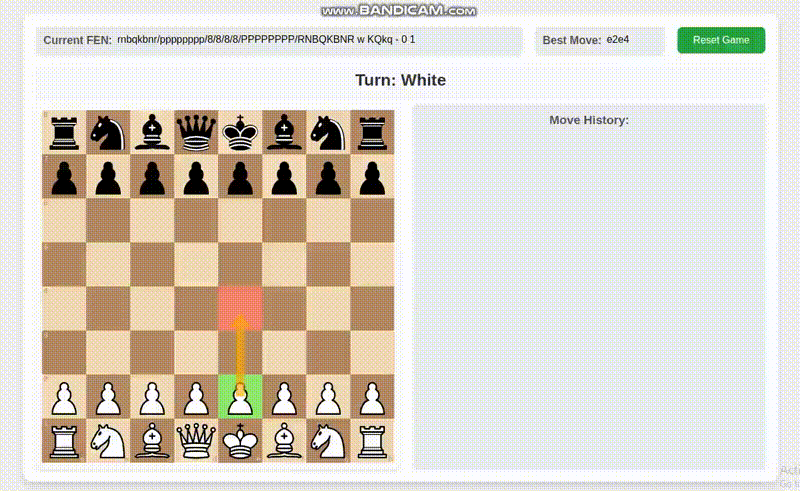

# Chess Master AI with Leela Chess Zero



**Chess Master AI** is a web application that integrates a powerful chess engine, **Lc0**, with a user-friendly interface to evaluate chess positions. The project uses a React frontend and a Flask backend, with **Lc0** acting as the backend engine for evaluating both FEN and move sequences.

## Features

- **Evaluate Chess Positions:** Input a series of chess moves or a FEN string, and the backend will evaluate the position using Lc0.
- **LLM-Powered Analysis (Optional):** Receive detailed analysis, alternative suggestions, and insights from a Large Language Model (LLM).
- **Interactive Chessboard:** Visualize moves and positions on a chessboard using the React frontend.

## Requirements

### Backend

- Python 3.8+
- Flask
- **Lc0 (Leela Chess Zero)**
- Optional: OpenAI API (or any other LLM provider)
- Gunicorn (for production)

### Frontend

- Node.js (v14+ recommended)
- React
- Axios (for API requests)
- React-Chessboard (or similar chessboard library)

### Recommended Operating System

**Ubuntu 18.04** is recommended as the OS for developing and running this project due to its compatibility with chess engines like Lc0, ease of setup, and robust development environment.

## Setup

### 1. Clone the Repository

```bash
git clone https://github.com/superbabii/Chess-Master-AI.git
cd ChessMasterAI
```

### 2. Backend Setup (with Ubuntu 18.04)

1. **Install Required Dependencies**:

   Before starting, ensure you have the necessary dependencies installed:

   ```bash
   sudo apt-get update
   sudo apt-get install libstdc++-8-dev clang-6.0 ninja-build pkg-config
   pip3 install meson --user
   ```

2. **Build and Set Up Lc0**:

   Clone the Lc0 repository and build it using **Clang 6.0**:

   ```bash
   git clone https://github.com/LeelaChessZero/lc0.git
   cd lc0
   CC=clang-6.0 CXX=clang++-6.0 INSTALL_PREFIX=~/.local ./build.sh
   ```

   After running the build script, make sure `~/.local/bin` is included in your PATH:

   ```bash
   export PATH=$HOME/.local/bin:$PATH
   ```

   You can now verify that Lc0 is installed by typing:

   ```bash
   lc0 --help
   ```

3. **Download Lc0 Weights**:

   Download the Lc0 network weights from the [Lc0 weights storage](https://storage.lczero.org/files) or through the [Lc0 official website](https://lczero.org/). Place the weights in the `backend/weights/` directory:

   ```bash
   mv path/to/downloaded/weights backend/weights/
   ```

4. **Set Up Python Environment and Dependencies**:

   Set up a virtual environment and install the required Python packages:

   ```bash
   cd backend
   python3 -m venv venv
   source venv/bin/activate  # On Windows use `venv\Scripts\activate`
   pip install -r requirements.txt
   ```

5. **Install Python Bindings for Lc0**:

   You can install the Python bindings for Lc0, which provides an interface for accessing all the Lc0 functionality:

   ```bash
   pip install --user git+https://github.com/LeelaChessZero/lc0.git
   ```

   This will build the package `lczero-bindings` and install it to your Python user install directory. All the Lc0 functionality related to position evaluation is now available in the module `lczero.backends`.

   ### Sample Code for Python Bindings

     Here's a Python example that demonstrates how to interact with the Lc0 engine using the Python bindings:
     
     ```python
     from lczero.backends import Weights, Backend, GameState
     
     # Step 1: Load Weights from the specified path
     weights_path = "744706.pb.gz"
     try:
         w = Weights(weights_path)
         print(f"Loaded weights from {weights_path}")
         print(f"Number of filters in the network: {w.filters()}")
     except Exception as e:
         print(f"Error loading weights: {e}")
         raise
     
     # Step 2: Display available backends
     available_backends = Backend.available_backends()
     print(f"Available Backends: {available_backends}")
     
     # Step 3: Create backend using the loaded weights
     try:
         b = Backend(weights=w)
         print(f"Backend created successfully with backend type: {b}")
     except Exception as e:
         print(f"Error creating backend: {e}")
         raise
     
     # Step 4: Initialize GameState with a series of moves
     try:
         g = GameState(moves=['e2e4', 'e7e5'])
         print("GameState after moves [e2e4, e7e5]:")
         print(g.as_string())
     except Exception as e:
         print(f"Error initializing GameState with moves: {e}")
         raise
     
     # Step 5: Create input for the backend from the current GameState
     try:
         i1 = g.as_input(b)
     except Exception as e:
         print(f"Error creating input for backend: {e}")
         raise
     
     # Step 6: Initialize another GameState using FEN notation
     fen = '2R5/5kpp/4p3/p4p2/3B4/1K5N/4rNPP/8 b - - 0 29'
     try:
         g_fen = GameState(fen=fen)
         i2 = g_fen.as_input(b)
         print("GameState from FEN:")
         print(g_fen.as_string())
     except Exception as e:
         print(f"Error initializing GameState with FEN: {e}")
         raise
     
     # Step 7: Evaluate both game states using the backend
     try:
         o1, o2 = b.evaluate(i1, i2)
         print(f"Evaluation for first state (q): {o1.q():.6f}")
         print(f"Evaluation for second state (q): {o2.q():.6f}")
     except Exception as e:
         print(f"Error during evaluation: {e}")
         raise
     
     # Step 8: Get the move probabilities from the first game state
     try:
         move_probs = list(zip(g.moves(), o1.p_softmax(*g.policy_indices())))
         print("\nMove probabilities for the first game state:")
         for move, prob in move_probs:
             print(f"Move: {move}, Probability: {prob:.6f}")
     except Exception as e:
         print(f"Error retrieving move probabilities: {e}")
         raise
     ```
     
     This sample code demonstrates loading the weights, evaluating positions based on moves or FEN notation, and retrieving evaluation results from the Lc0 engine.
     
     ---

6. **Run the Backend**:

   Start the Flask server:

   ```bash
   flask run
   ```

   This will start the backend at `http://127.0.0.1:5000/`.

### 3. Frontend Setup

1. **Install Node.js and Dependencies**:

   Make sure Node.js is installed. Then, install the frontend dependencies:

   ```bash
   cd frontend
   npm install
   ```

2. **Start the React Development Server**:

   Run the React frontend:

   ```bash
   npm start
   ```

   This will start the React application at `http://localhost:3000/`.

---

### API Endpoints

#### 1. Evaluation Endpoint

You can send a POST request to the `/evaluate` endpoint with a FEN string to get the best move and evaluation score.

- **Request URL**:  
  `http://localhost:5000/evaluate`
  
- **Request Method**:  
  POST

- **Sample Request Body**:

  ```json
  {
    "fen": "rnbqkbnr/pppp1ppp/8/4p3/4P3/5N2/PPPP1PPP/RNBQKB1R b KQkq - 1 2"
  }
  ```

- **Sample Response**:

  ```json
  {
    "best_move": {
      "from": "b8",
      "to": "c6"
    },
    "evaluation": -0.08955998718738556
  }
  ```

This will provide the best move from position `b8` to `c6` and the evaluation score `-0.08955998718738556`.

---

## License

This project is licensed under the MIT License.

